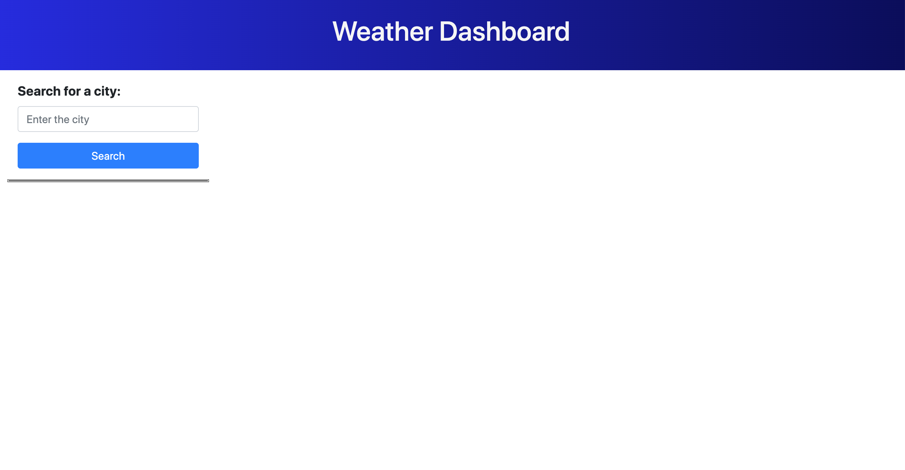
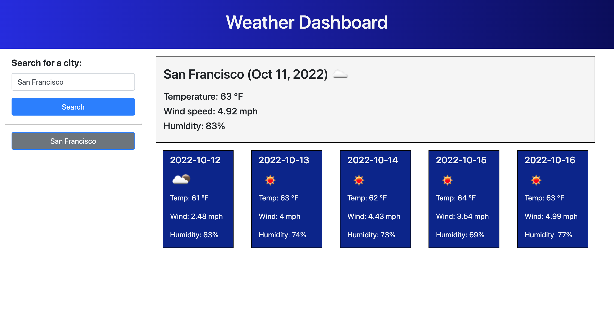
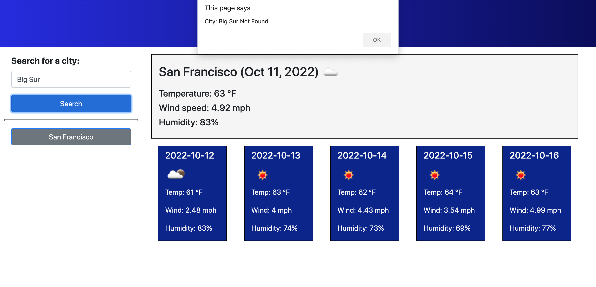
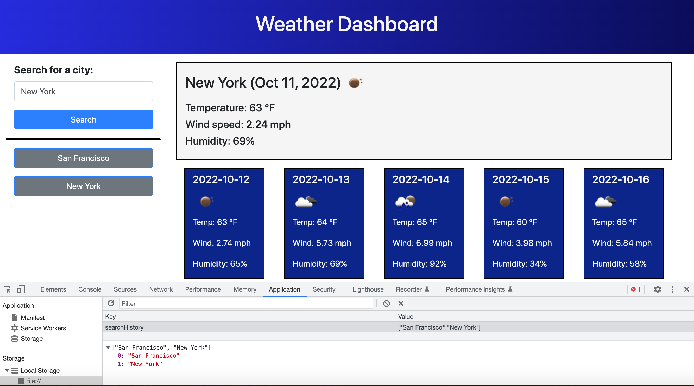
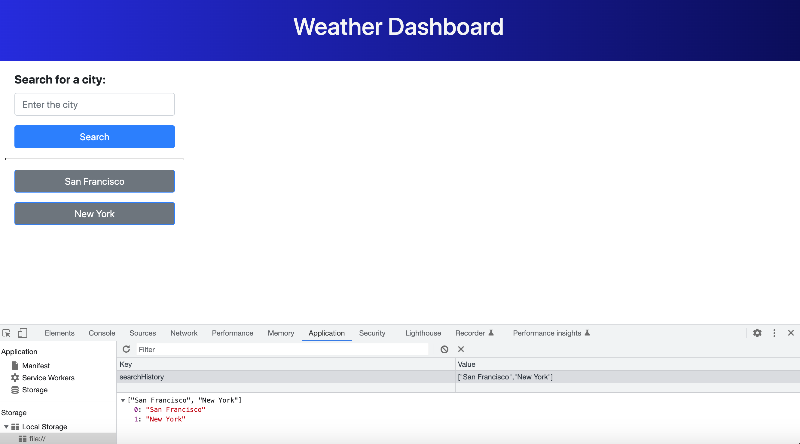

# A-Weather-Dashboard
## Table of Contents
* [Description](#description)
* [Wireframe](#wireframe)
* [Screenshots](#screenshots)
* [Code Snippets](#code-snippets)
* [Technologies Used](#technologies-used)
* [Credits](#credits)
* [Author Links](#author-links)

## Description

This Weather Dashboard application offers a simple, effective way to look up the current weather and 5 day forecast for cities. It uses the Open Weather Map API to retrieve the information and display it in a dynamically created, responsive interface. The application has been deployed to the Github Pages at [Weather Dashboard](https://sbhikshe.github.io/A-Weather-Dashboard/).

## Wireframe


## Screenshots
### *1. Initial Screen with city search form*


### *2. Enter city and search - current and 5 day forecast*


### *3. Entering a place that Open Weather cannot find*


### *4. Cities searched stored in local storage - search history*


### *5. Search history displayed on application refresh*


## Code Snippets

### 1. Fetch request to get 
#### Send out the fetch request to get the latitude and longitude for a city. Throw and catch any errors, and alert the user if the city is not found by the Open Weather API. Else go ahead and call functions to get the current weather and 5 day forecast.
```
  var requestUrl = "https://api.openweathermap.org/data/2.5/forecast?q=" + searchCity + "&appid=" + "a8f97ddc7ad9ecf69e905ace742d4325";

  fetch(requestUrl)
  .then (function(response) {
      console.log("Received response to get coords request: " + response.statusText);
      if(response.ok) {
        response.json().then(function(data) {
          /* get the latitude, longitude */
          console.log("latitude " + data.city.coord.lat + ", longitude: " + data.city.coord.lon);
          getCurrentConditions(data.city.coord.lat, data.city.coord.lon);
          getFiveDayForecast(data.city.coord.lat, data.city.coord.lon);
          if (addCityToSearchHistory(searchCity) == true) {
            displaySearchHistory();
          }
        })
      } else {
        alert("City: " + searchCity + " " + response.statusText);
      }
    })
  .catch ( function(error) {
    alert ("Unable to connect");
  });
```
### 2. Dynamically create HTML to display the current weather.
```
 var divEl = cityWeatherTodayEl.children();
  if (divEl.length === 0) {
    currentDayObj.cityNameEl = $('<h3>');
    cityWeatherTodayEl.append(currentDayObj.cityNameEl);

    currentDayObj.iconEl = $('');
    currentDayObj.cityNameEl.append(currentDayObj.iconEl);

    currentDayObj.dateEl = $('<h3>');
    cityWeatherTodayEl.append(currentDayObj.dateEl);

    currentDayObj.temperatureEl = $('<h5>');
    cityWeatherTodayEl.append(currentDayObj.temperatureEl);

    currentDayObj.windEl = $('<h5>');
    cityWeatherTodayEl.append(currentDayObj.windEl);

    currentDayObj.humidityEl = $('<h5>');
    cityWeatherTodayEl.append(currentDayObj.humidityEl);
  }
```

## Technologies Used
- HTML
- CSS
- JavaScript
- jQuery
- Bootstrap
- Server Side API - Fetch & Open Weather Map

## Credits
[Open Weather Map API](https://openweathermap.org/api)\
[Using the Fetch API](https://developer.mozilla.org/en-US/docs/Web/API/Fetch_API/Using_Fetch)\
[BootStrap](https://getbootstrap.com/docs/4.0/layout/overview/)

## Author Links
[LinkedIn](https://www.linkedin.com/in/sripriya-bhikshesvaran-8520992/)\
[Github](https://github.com/sbhikshe)
