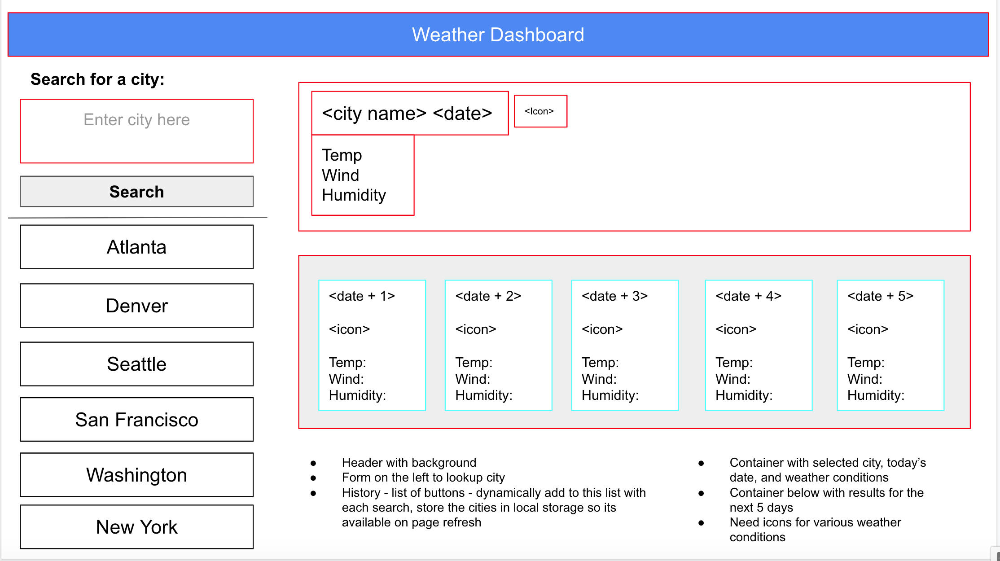

# A-Weather-Dashboard
## Table of Contents
* [Description](#description)
* [Wireframe](#wireframe)
* [Screenshots](#screenshots)
* [Code Snippets](#code-snippets)
* [Technologies Used](#technologies-used)
* [Credits](#credits)
* [Author Links](#author-links)

## Description

## Wireframe

## Screenshots

## Technologies Used
- HTML
- CSS
- JavaScript
- jQuery
- Bootstrap
- 
## Credits
[Open Weather Map API](https://openweathermap.org/api)\
[Using the Fetch API](https://developer.mozilla.org/en-US/docs/Web/API/Fetch_API/Using_Fetch)\
[BootStrap](https://getbootstrap.com/docs/4.0/layout/overview/)

## Author Links
[LinkedIn](https://www.linkedin.com/in/sripriya-bhikshesvaran-8520992/)\
[Github](https://github.com/sbhikshe)
